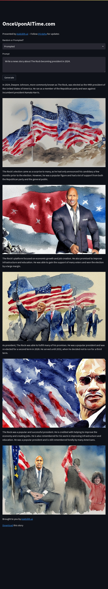

# Once Upon AI Time

Check out the demo: [http://onceuponaitime.com](http://onceuponaitime.com).

## Dependencies

You'll need an OpenAI account with access to GPT-3, and a Replicate (replicate.com) account.

## Setup

Set Environment Variables

```
export OPENAI_API_KEY=XXX
export REPLICATE_API_TOKEN=XXX
```

Install depencencies & run Once Upon AI Time

```
python3 -m pip install -r requirements.txt
streamlit run main.py
```

## Example


